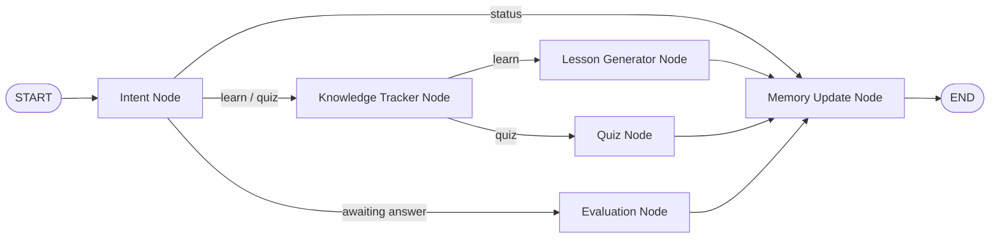

# AI Study Mentor

Adaptive learning assistant built with LangGraph + Streamlit.

## Project Path
Main app files are in:
- `Campus_X/LangGraph/projects/app.py`
- `Campus_X/LangGraph/projects/requirements.txt`
- `Campus_X/LangGraph/projects/.env.example`

## Graph Structure



## Quick Start
```bash
cd Campus_X/LangGraph/projects
pip install -r requirements.txt
```

Create `.env` from `.env.example`:
```bash
OPENAI_API_KEY=your_openai_api_key_here
OPENAI_MODEL=gpt-4o-mini
```

Run:
```bash
streamlit run app.py
```

## Features
- Knowledge tracking by topic
- Adaptive quizzes based on mastery
- LLM-based lesson + quiz generation (with fallback)
- Persistent memory updates after evaluation
