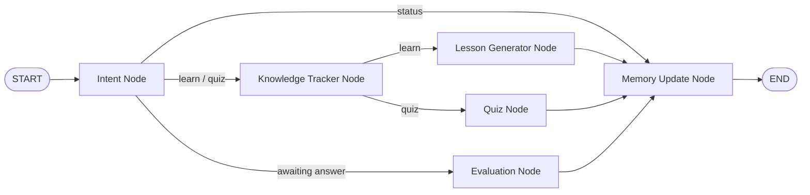

# AI Study Mentor (LangGraph + Streamlit)

An adaptive learning assistant built with LangGraph.

## What it does
- Tracks what the learner knows by topic
- Asks adaptive quiz questions
- Explains weak topics
- Updates memory after each evaluation

## Graph Structure



Nodes used in code:
- Intent node
- Knowledge tracker node
- Lesson generator node
- Quiz node
- Evaluation node
- Memory update node

## State Persistence
The app persists learner state in Streamlit session state:
- topic mastery scores
- active topic
- weakest topic
- quiz attempts/correct answers
- pending quiz question context

## Tech Stack
- Streamlit
- LangGraph
- LangChain OpenAI
- Python Dotenv

## Setup
```bash
cd Campus_X/LangGraph/projects
pip install -r requirements.txt
```

Create `.env` from `.env.example`:
```bash
OPENAI_API_KEY=your_openai_api_key_here
OPENAI_MODEL=gpt-4o-mini
```

## Run
```bash
streamlit run app.py
```

## How to use
- Ask for a concept explanation: `teach me statistics`
- Request adaptive quiz: `quiz python`
- Answer with option number or text
- View progress report: `status`

## LLM and Fallback
- If `OPENAI_API_KEY` is set, lesson + quiz generation uses LLM.
- If not set, the app uses built-in fallback content.

## Portfolio Value
- Demonstrates graph-based orchestration
- Demonstrates adaptive learning logic
- Demonstrates persistent memory updates across turns
